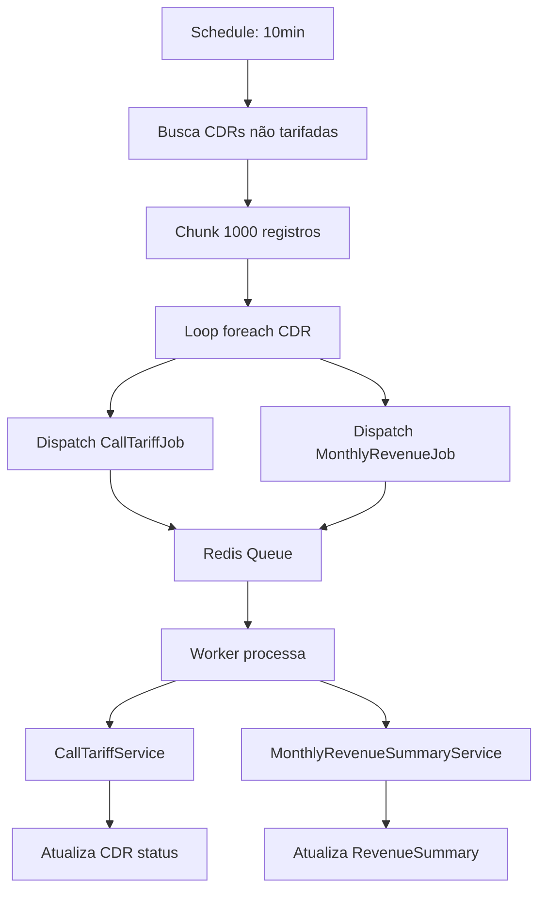
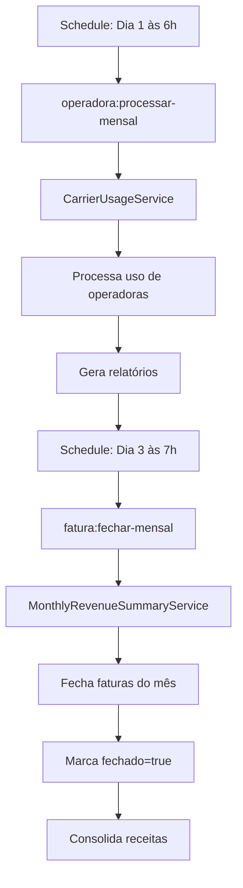
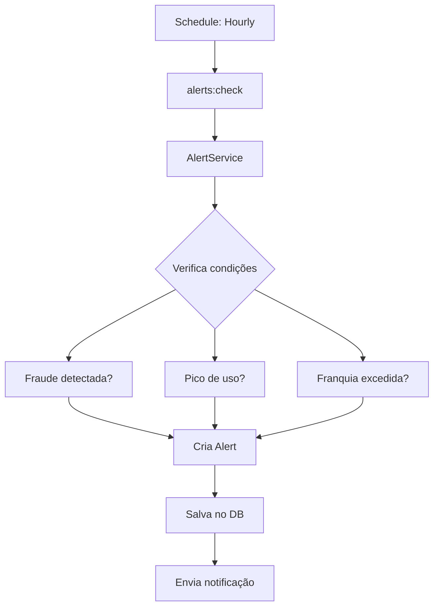

# Arquitetura de Backend - ASBC System

## Índice
1. [Visão Geral](#visão-geral)
2. [Services](#services)
3. [Jobs e Queues](#jobs-e-queues)
4. [Commands (Artisan)](#commands-artisan)
5. [Models](#models)
6. [Enums](#enums)
7. [Controllers](#controllers)
8. [Scheduled Tasks](#scheduled-tasks)
9. [Providers](#providers)
10. [Queue Configuration](#queue-configuration)

---

## Visão Geral

**Stack Técnica:**
- Laravel 12.42.0
- PHP 8.4.13
- PostgreSQL
- Redis (Queue Driver)
- Livewire 3.7.1
- Timezone: America/Sao_Paulo
- Locale: pt_BR

**Ambiente:**
- Environment: local
- Debug: ENABLED
- URL: controle.rrpsystems.com.br
- Cache Driver: database
- Session Driver: database
- Queue Driver: redis

---

## Services

Camada de lógica de negócio que encapsula operações complexas.

### 1. CallTariffService
**Arquivo:** `app/Services/CallTariffService.php`
**Responsabilidade:** Gerenciar tarifação de chamadas (CDRs)
- Calcular custos por tipo de tarifa (Fixo, Móvel, DDI)
- Aplicar regras de tarifação
- Validar e processar CDRs

### 2. MonthlyRevenueSummaryService
**Arquivo:** `app/Services/MonthlyRevenueSummaryService.php`
**Responsabilidade:** Gerar resumos mensais de receita
- Consolidar receitas por cliente
- Calcular franquias e excedentes
- Gerar faturas mensais

### 3. CarrierUsageService
**Arquivo:** `app/Services/CarrierUsageService.php`
**Responsabilidade:** Controlar uso de operadoras
- Rastrear consumo de franquias
- Calcular custos de operadoras
- Gerar relatórios de uso

### 4. CarrierCostAllocationService
**Arquivo:** `app/Services/CarrierCostAllocationService.php`
**Responsabilidade:** Alocar custos de operadoras
- Distribuir custos entre clientes
- Calcular rateios
- Gerar relatórios de alocação

### 5. AlertService
**Arquivo:** `app/Services/AlertService.php`
**Responsabilidade:** Gerenciar sistema de alertas
- Detectar fraudes
- Monitorar picos de uso
- Gerar notificações
- Verificar limites de franquia

---

## Jobs e Queues

**Queue Driver:** Redis
**Default Queue:** default
**Retry After:** 90 segundos

### 1. CallTariffJob
**Arquivo:** `app/Jobs/CallTariffJob.php`
**Trigger:** Despachado a cada 10 minutos via Schedule
**Responsabilidade:**
- Processar tarifação de CDRs individuais
- Atualizar status de chamadas
- Calcular custos em background

**Payload:** Recebe um objeto `Cdr`

### 2. MonthlyRevenueJob
**Arquivo:** `app/Jobs/MonthlyRevenueJob.php`
**Trigger:** Despachado a cada 10 minutos via Schedule
**Responsabilidade:**
- Processar receita mensal de CDRs
- Atualizar resumos de faturamento
- Consolidar dados para faturas

**Payload:** Recebe um objeto `Cdr`

### 3. ProcessarCdrJob
**Arquivo:** `app/Jobs/ProcessarCdrJob.php`
**Trigger:** Manual ou via comando
**Responsabilidade:**
- Processar lote de CDRs
- Validar dados de chamadas
- Preparar para tarifação

**Status:** Legacy (pode estar em desuso, verificar uso)

---

## Commands (Artisan)

### 1. ProcessarCdrsCommand
**Comando:** `php artisan cdrs:processar`
**Arquivo:** `app/Console/Commands/ProcessarCdrsCommand.php`
**Responsabilidade:**
- Processar CDRs pendentes manualmente
- Reprocessar CDRs com erro
- Útil para manutenção

### 2. FecharFaturasMensalCommand
**Comando:** `php artisan fatura:fechar-mensal`
**Arquivo:** `app/Console/Commands/FecharFaturasMensalCommand.php`
**Schedule:** Dia 3 de cada mês às 7h
**Responsabilidade:**
- Fechar faturas do mês anterior
- Consolidar receitas
- Marcar faturas como fechadas
- Gerar relatórios finais

### 3. ProcessarRelatorioOperadoraMensalCommand
**Comando:** `php artisan operadora:processar-mensal`
**Arquivo:** `app/Console/Commands/ProcessarRelatorioOperadoraMensalCommand.php`
**Schedule:** Dia 1 de cada mês às 6h
**Responsabilidade:**
- Processar relatórios mensais de operadoras
- Consolidar uso de franquias
- Calcular custos mensais
- Gerar relatórios de alocação

### 4. GerarRelatorioOperadoraCommand
**Comando:** `php artisan operadora:gerar-relatorio`
**Arquivo:** `app/Console/Commands/GerarRelatorioOperadoraCommand.php`
**Responsabilidade:**
- Gerar relatórios de operadora sob demanda
- Exportar dados de uso
- Análise de custos

### 5. CheckAlerts
**Comando:** `php artisan alerts:check`
**Arquivo:** `app/Console/Commands/CheckAlerts.php`
**Schedule:** A cada hora
**Responsabilidade:**
- Verificar condições de alerta
- Detectar fraudes
- Monitorar picos de uso
- Verificar excesso de franquia
- Enviar notificações

### 6. ReabrirFaturaCommand
**Comando:** `php artisan fatura:reabrir`
**Arquivo:** `app/Console/Commands/ReabrirFaturaCommand.php`
**Responsabilidade:**
- Reabrir faturas fechadas para correção
- Permitir ajustes manuais
- Útil para manutenção

### 7. RefaturarCommand
**Comando:** `php artisan fatura:refaturar`
**Arquivo:** `app/Console/Commands/RefaturarCommand.php`
**Responsabilidade:**
- Recalcular faturas existentes
- Corrigir erros de tarifação
- Reprocessar período específico

---

## Models

### Core Models

#### 1. Cdr (Call Detail Record)
**Arquivo:** `app/Models/Cdr.php`
**Tabela:** `cdrs`
**Responsabilidade:** Registro de chamadas telefônicas
- Armazena detalhes de cada chamada
- Relaciona com Customer, Carrier, Did
- Status de tarifação
- Custos e durações

#### 2. Customer
**Arquivo:** `app/Models/Customer.php`
**Tabela:** `customers`
**Responsabilidade:** Clientes do sistema
- Dados cadastrais
- Produtos contratados
- Configurações de franquia
- DIDs associados

#### 3. Carrier
**Arquivo:** `app/Models/Carrier.php`
**Tabela:** `carriers`
**Responsabilidade:** Operadoras de telefonia
- Dados da operadora
- Planos e franquias
- Custos e tarifas
- Configurações de uso

#### 4. Did
**Arquivo:** `app/Models/Did.php`
**Tabela:** `dids`
**Responsabilidade:** Números (DIDs)
- Números telefônicos
- Associação cliente-operadora
- Encaminhamentos
- Status ativo/inativo

#### 5. Rate
**Arquivo:** `app/Models/Rate.php`
**Tabela:** `rates`
**Responsabilidade:** Tarifas de chamadas
- Tabela de preços
- Custos por destino
- Tipos de tarifa (Fixo, Móvel, DDI)
- Vigência

### Financial Models

#### 6. RevenueSummary
**Arquivo:** `app/Models/RevenueSummary.php`
**Tabela:** `revenue_summaries`
**Responsabilidade:** Resumo mensal de receitas
- Consolidação mensal por cliente
- Valores de plano e excedente
- Minutos consumidos
- Status de fechamento

#### 7. CarrierUsage
**Arquivo:** `app/Models/CarrierUsage.php`
**Tabela:** `carrier_usages`
**Responsabilidade:** Uso de operadoras
- Consumo de franquia
- Custos por tipo de serviço
- Período de apuração

#### 8. CustomerProduct
**Arquivo:** `app/Models/CustomerProduct.php`
**Tabela:** `customer_products`
**Responsabilidade:** Produtos contratados
- Produtos/serviços do cliente
- Valores e quantidades
- Status ativo/inativo

### System Models

#### 9. User
**Arquivo:** `app/Models/User.php`
**Tabela:** `users`
**Responsabilidade:** Usuários do sistema
- Autenticação
- Níveis de acesso (admin, customer, operator)
- Relacionamento com clientes

#### 10. Alert
**Arquivo:** `app/Models/Alert.php`
**Tabela:** `alerts`
**Responsabilidade:** Alertas do sistema
- Tipos de alerta (fraude, franquia, pico)
- Severidade (critical, high, medium, low)
- Status (novo, lido, resolvido)
- Relacionamentos com Customer/Carrier

#### 11. Audio
**Arquivo:** `app/Models/Audio.php`
**Tabela:** `audios`
**Responsabilidade:** Áudios do sistema
- Gravações de chamadas
- Mensagens de voz
- Arquivos de mídia

### Legacy Models (Verificar uso)

#### 12. Call
**Arquivo:** `app/Models/Call.php`
**Status:** Pode estar em desuso, verificar uso

#### 13. Endpoint
**Arquivo:** `app/Models/Endpoint.php`
**Status:** Pode estar em desuso, verificar uso

---

## Enums

### 1. UserRole
**Arquivo:** `app/Enums/UserRole.php`
**Valores:**
- `admin` - Administrador do sistema
- `customer` - Cliente
- `operator` - Operador

### 2. TipoTarifa
**Arquivo:** `app/Enums/TipoTarifa.php`
**Valores:**
- `Fixo` - Chamadas para telefone fixo
- `Movel` - Chamadas para celular
- `Internacional` - Chamadas internacionais (DDI)

### 3. TipoProduto
**Arquivo:** `app/Enums/TipoProduto.php`
**Valores:**
- Tipos de produtos/serviços oferecidos
- Categorização de serviços

### 4. DialStatus
**Arquivo:** `app/Enums/DialStatus.php`
**Valores:**
- Status de discagem de chamadas
- Estados do Asterisk/PBX

### 5. IsdnHangupCause
**Arquivo:** `app/Enums/IsdnHangupCause.php`
**Valores:**
- Códigos de desligamento ISDN
- Causas de término de chamada

### 6. AudioIdentifier
**Arquivo:** `app/Enums/AudioIdentifier.php`
**Valores:**
- Identificadores de áudios do sistema
- Mensagens pré-gravadas

---

## Controllers

### Config Namespace

#### 1. UserController
**Arquivo:** `app/Http/Controllers/Config/UserController.php`
**Rota:** `config.user`
**Responsabilidade:** Gerenciar usuários

#### 2. CustomerController
**Arquivo:** `app/Http/Controllers/Config/CustomerController.php`
**Rota:** `config.customer`
**Responsabilidade:** Gerenciar clientes

#### 3. CarrierController
**Arquivo:** `app/Http/Controllers/Config/CarrierController.php`
**Rota:** `config.carrier`
**Responsabilidade:** Gerenciar operadoras

#### 4. DidController
**Arquivo:** `app/Http/Controllers/Config/DidController.php`
**Rota:** `config.did`
**Responsabilidade:** Gerenciar DIDs

#### 5. RateController
**Arquivo:** `app/Http/Controllers/Config/RateController.php`
**Rota:** `config.rate`
**Responsabilidade:** Gerenciar tarifas

### Report Namespace

#### 6. CdrController
**Arquivo:** `app/Http/Controllers/Report/CdrController.php`
**Rota:** `report.cdr`
**Responsabilidade:** Relatórios de CDR

#### 7. InvoiceController
**Arquivo:** `app/Http/Controllers/Report/InvoiceController.php`
**Rota:** `report.invoice`
**Responsabilidade:** Relatórios de faturas

#### 8. ProfitabilityController
**Arquivo:** `app/Http/Controllers/Report/ProfitabilityController.php`
**Rota:** `report.profitability`
**Responsabilidade:** Análise de rentabilidade

#### 9. QualityController
**Arquivo:** `app/Http/Controllers/Report/QualityController.php`
**Rota:** `report.quality-analysis`
**Responsabilidade:** Análise de qualidade (ASR/ACD)

#### 10. ForecastController
**Arquivo:** `app/Http/Controllers/Report/ForecastController.php`
**Rota:** `report.revenue-forecast`
**Responsabilidade:** Previsão de faturamento

#### 11. FraudController
**Arquivo:** `app/Http/Controllers/Report/FraudController.php`
**Rota:** `report.fraud-detection`
**Responsabilidade:** Detecção de fraude

#### 12. RouteController
**Arquivo:** `app/Http/Controllers/Report/RouteController.php`
**Rota:** `report.route-analysis`
**Responsabilidade:** Análise de rotas (LCR)

### Root Namespace

#### 13. AlertController
**Arquivo:** `app/Http/Controllers/AlertController.php`
**Rota:** `alerts.index`
**Responsabilidade:** Central de alertas

---

## Scheduled Tasks

### Schedule Configuration
**Arquivo:** `routes/console.php`

#### 1. Processamento de CDRs
**Frequência:** A cada 10 minutos (24/7)
**Descrição:**
```php
Schedule::call(function () {
    Cdr::where('status', '!=', 'Tarifada')->chunk(1000, function ($cdrs) {
        foreach ($cdrs as $cdr) {
            CallTariffJob::dispatch($cdr);
            MonthlyRevenueJob::dispatch($cdr);
        }
    });
})->everyTenMinutes();
```
- Processa CDRs não tarifadas em lotes de 1000
- Despacha jobs para tarifação e consolidação de receita
- Tratamento de erros com log

#### 2. Processamento Mensal de Operadoras
**Frequência:** Dia 1 de cada mês às 6h
**Comando:** `operadora:processar-mensal`
**Descrição:**
- Processa relatórios mensais de todas as operadoras
- Consolida uso de franquias do mês anterior
- Calcula custos finais
- Gera relatórios de alocação

#### 3. Fechamento Mensal de Faturas
**Frequência:** Dia 3 de cada mês às 7h
**Comando:** `fatura:fechar-mensal`
**Descrição:**
- Fecha faturas do mês anterior
- Marca como não editável
- Consolida receitas finais
- Prepara para faturamento

#### 4. Verificação de Alertas
**Frequência:** A cada hora
**Comando:** `alerts:check`
**Descrição:**
- Verifica condições de alerta
- Detecta padrões de fraude
- Monitora picos de uso
- Verifica limites de franquia
- Envia notificações

#### 5. Inspire Command
**Frequência:** A cada hora
**Comando:** `inspire`
**Descrição:** Comando de exemplo do Laravel (pode ser removido)

---

## Providers

### 1. AppServiceProvider
**Arquivo:** `app/Providers/AppServiceProvider.php`
**Responsabilidade:**
- Registrar bindings do service container
- Configurações globais da aplicação
- Boot de serviços

### 2. VoltServiceProvider
**Arquivo:** `app/Providers/VoltServiceProvider.php`
**Responsabilidade:**
- Configurar Livewire Volt
- Registrar componentes funcionais
- Configurações de hot reload

---

## Queue Configuration

**Arquivo:** `config/queue.php`

### Default Connection
```php
'default' => env('QUEUE_CONNECTION', 'database')
```

### Connections Configuradas

#### Database
```php
'database' => [
    'driver' => 'database',
    'table' => 'jobs',
    'queue' => 'default',
    'retry_after' => 90,
],
```

#### Redis (Atual)
```php
'redis' => [
    'driver' => 'redis',
    'connection' => 'default',
    'queue' => 'default',
    'retry_after' => 90,
],
```

### Job Batching
```php
'batching' => [
    'database' => env('DB_CONNECTION', 'sqlite'),
    'table' => 'job_batches',
],
```

### Failed Jobs
```php
'failed' => [
    'driver' => 'database-uuids',
    'database' => env('DB_CONNECTION', 'sqlite'),
    'table' => 'failed_jobs',
],
```

---

## Fluxo de Processamento

### 1. Fluxo de Tarifação de CDRs



### 2. Fluxo de Fechamento Mensal



### 3. Fluxo de Alertas



---

## Observações e Melhorias

### Observações Atuais

1. **Queue Driver:** Atualmente usando Redis, mas configuração padrão é Database
2. **Storage Link:** Não criado (`public/storage` NOT LINKED)
3. **Cache:** Views cacheadas, mas config/events/routes não
4. **Locale:** Configurado para pt_BR corretamente
5. **Debug Mode:** Ativo (lembrar de desativar em produção)

### Sugestões de Melhorias

1. **Jobs Legacy:**
   - Revisar `ProcessarCdrJob.php` - pode estar duplicado
   - Consolidar lógica de processamento

2. **Models Legacy:**
   - Verificar uso de `Call.php` e `Endpoint.php`
   - Remover se não utilizados

3. **Monitoramento:**
   - Implementar dashboard de jobs falhados
   - Adicionar métricas de performance
   - Logs estruturados para análise

4. **Performance:**
   - Implementar cache de rates (tarifas)
   - Otimizar queries com eager loading
   - Indexar colunas de busca frequente

5. **Segurança:**
   - Desativar debug em produção
   - Implementar rate limiting em APIs
   - Validação de dados mais rigorosa

6. **Testes:**
   - Criar testes unitários para Services
   - Testes de integração para Jobs
   - Testes de feature para Commands

---

*Documento gerado em: 27/12/2025*
*Versão: 1.0*
